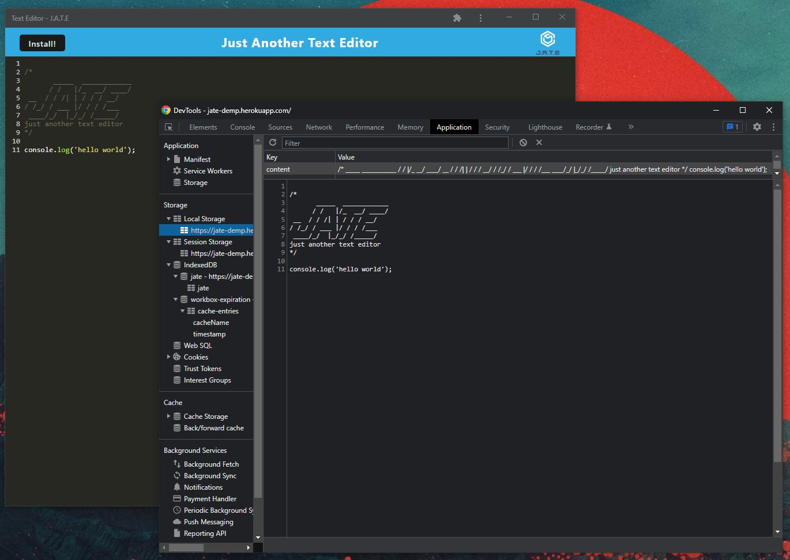

# Just Another Text Editor
[](https://opensource.org/licenses/MIT)

## Description <br>
J.A.T.E. is just another text editor. Users can type any text but it also follows javascript syntax. Users can install the aplication as a pwa and use it offline. The data is stored locally using IndexedDb. [Click here for a live deployment](https://jate-demp.herokuapp.com/)

## Table of Contents
[Installation](#Installation)<br>
[Usage](#Usage)<br>
[License](#Just-Another-Text-Editor)<br>
[Contributing](#Contributing)<br>
[Tests](#Tests)<br>
[Questions](#Questions)<br>
    

## Installation
To install the app as a PWA click on the install button on the navbar or the install button on the url bar in google chrome. Firefox users and other browsers may need to install additional plugins to install PWAs.

To install the application from this repository, first clone the repo to the desired directory.
- While in the root directory of the repository enter the following bash command to install all the dependencies
```
npm i
```
- To build and run the application. After running the command a dist directory will be created containing the bundled code.
```
npm start
```
- To run the server and client concurrently: 
```
npm run start:dev
```
- To build the application without running it:
```
npm run build
```
- To run the server: 
```
npm run server
```
- to run the client code: 
```
npm run client
```

## Usage
Users can type in any text into the editor. It will highlight javascript syntax. Users are able to install the application as a PWA and use it offline.
<br>

<br>

<br>

<br>

<br>

## Contributing
To contribute to the project, developers can fork the repostory and post github issues for any problems. They can create pull requests if they want to present their own changes.

## Tests
There are no test for the application.

## Questions
If you have any questions about the repo, open an issue or contact me directly at [dempoleon@gmail.com](dempoleon@gmail.com).
You can find more of my work at [dempleon](https://github.com/dempleon)


